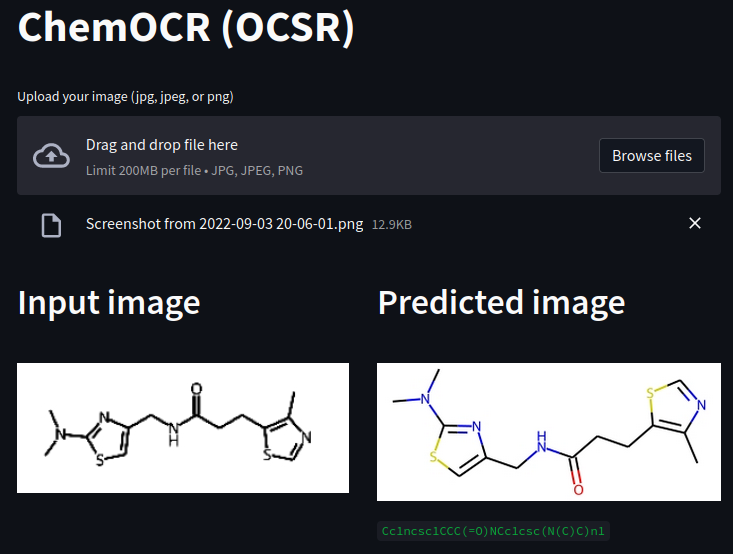
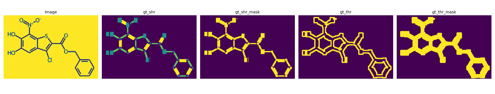

<h1 align="center">
ChemOCR(OCSR)
</h1>

<h3 align="center">
DB(Differentiable Binarization)-based Optical Chemical Structure Recognition  
</h3> 

### Backbone

- Swin
- ResNet
- MobileNetV3

## Parser
**Rule-based method**

## DATA

- ChEMBL: https://www.ebi.ac.uk/chembl/

### Training data sample

### Limitation
- Molecular Weight < 600
- Non-ion molecule
- (Inner bridged) Complex Ring is not possible.

### TODO
- [x] Character recognition (performance)
- [x] Web front-end (streamlit)
- [ ] Bond direction analysis
- [ ] Docs

## References

1. https://github.com/MhLiao/DB
2. https://github.com/open-mmlab/mmocr
3. https://github.com/rdkit/rdkit
